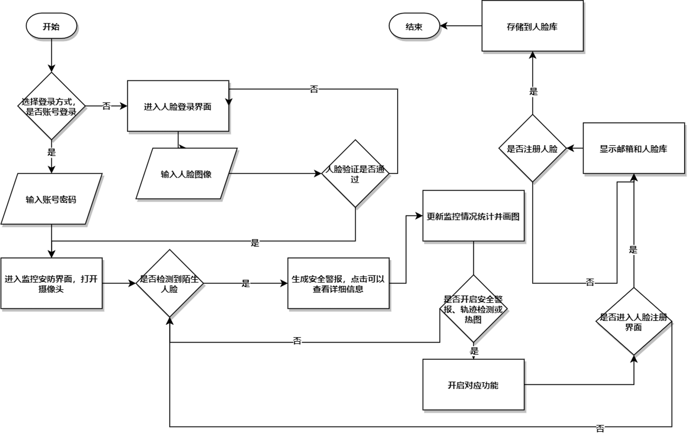
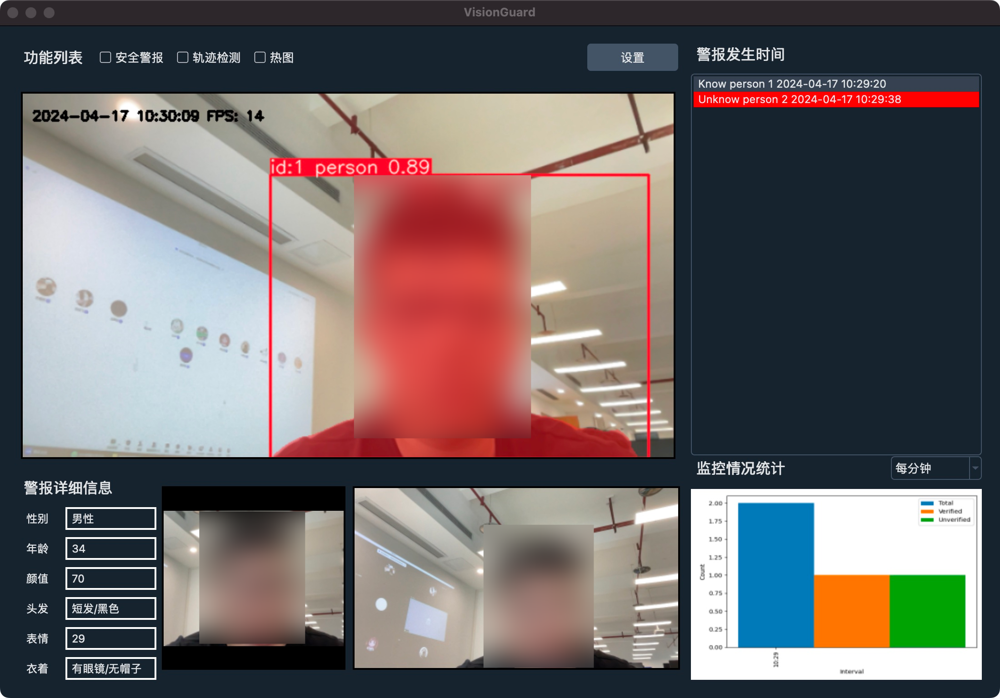

<div align="center">
  
  <h1 style="text-align: center;">Vision Guard</h1>
</div>

An Intelligent Monitoring and Security System built using **OpenCV**, **YOLO**, **face_recognition**, **PySide6**.


# Program functionality

1. **Data Collection and Preprocessing**: Utilizes the OpenCV library to capture and preprocess data from the camera feed.
2. **Face Detection**: Employs the YOLOv8 model to detect faces and other objects in the real-time video stream.
3. **Face Recognition and Analysis**: Integrates the face_recognition (dlib) library to detect, recognize, and analyze facial features. This includes silent liveness detection and facial feature analysis using the APIs provided by **iFLYTEK** and **Tencent Cloud**.
4. **Behavior Detection**: Monitors and detects the behavior of individuals in the camera feed.
5. **Object Detection and Recognition**: Leverages the YOLOv8 model to detect and recognize various objects in the video stream.
6. **Security Alerts**: Sends timely email alerts using the smtplib and email libraries when suspicious activities or unknown faces are detected.



# Preview



# Deployment

> It is recommended to configure the required dependencies in a virtual Python environment
```shell
pip install -r requirements.txt
```
The version described in `requirements.txt` is exported by the `pipreq` command. In theory, similar versions can also run smoothly.

After preparing the dependent environment, you need to fill in `example-config.json` in `resource` directory and rename it to `config.json` before it can run normally.

The face login function relies on **iFlytek's silent liveness detection API**, the **face feature analysis relies on Tencent SDK**, and the security alert email function requires the **SMTP service** provided by the email service provider. If you need to use all the functions of the system, please fill in all items in the `config.json` file.