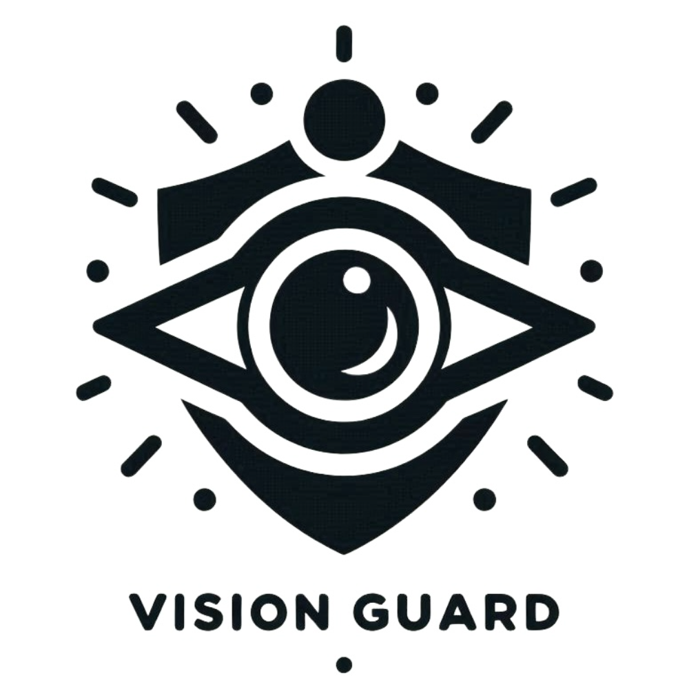

<div style="display: flex; justify-content: center;">
  
</div>
<br>
<h1 style="text-align: center;">Vision Guard</h1>

An Intelligent Monitoring and Security System built using **OpenCV**, **YOLO**, **face_recognition**, **PySide6**.


# Program functionality

1. **Data Collection and Preprocessing**: Utilizes the OpenCV library to capture and preprocess data from the camera feed.
2. **Face Detection**: Employs the YOLOv8 model to detect faces and other objects in the real-time video stream.
3. **Face Recognition and Analysis**: Integrates the face_recognition (dlib) library to detect, recognize, and analyze facial features. This includes silent liveness detection and facial feature analysis using the APIs provided by **iFLYTEK** and **Tencent Cloud**.
4. **Behavior Detection**: Monitors and detects the behavior of individuals in the camera feed.
5. **Object Detection and Recognition**: Leverages the YOLOv8 model to detect and recognize various objects in the video stream.
6. **Security Alerts**: Sends timely email alerts using the smtplib and email libraries when suspicious activities or unknown faces are detected.


# Preview


# Deployment

> It is recommended to configure the required dependencies in a virtual Python environment
```shell
pip install -r requirements.txt
```
The version described in `requirements.txt` is exported by the `pipreq` command. In theory, similar versions can also run smoothly.